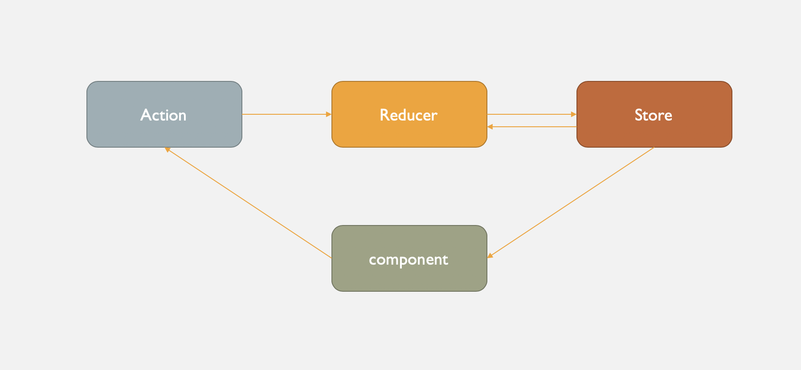

# Built With

## Tech and Packages

The app is built based on [react-native] and [Expo] framework. The app is using functional components and [react-hooks] (useState, useEffect, useContext, useReducer, useRef , ...etc) & [Context API] for state management, and [typescript] for static type-checking along with the latest ECMAScript features. We used [react-navigation V5] for handling stack navigation, tabs, and top bars. We have also used [native-base] and [paper] for some of our UI components

Check out the app package.json here:

```
....
"dependencies": {
    "@react-native-community/masked-view": "0.1.6",
    "@react-navigation/bottom-tabs": "^5.1.1",
    "@react-navigation/drawer": "^5.1.1",
    "@react-navigation/native": "^5.0.9",
    "@react-navigation/stack": "^5.1.1",
    "axios": "^0.19.2",
    "expo": "^37.0.0",
    "expo-camera": "~8.2.0",
    "expo-constants": "~9.0.0",
    "expo-face-detector": "~8.1.0",
    "expo-file-system": "~8.1.0",
    "expo-image-manipulator": "~8.1.0",
    "expo-secure-store": "~8.1.0",
    "moment": "^2.24.0",
    "native-base": "^2.13.8",
    "react": "16.9.0",
    "react-native": "https://github.com/expo/react-native/archive/sdk-37.0.0.tar.gz",
    "react-native-gesture-handler": "~1.6.0",
    "react-native-paper": "^3.6.0",
    "react-native-reanimated": "~1.7.0",
    "react-native-safe-area-context": "0.7.3",
    "react-native-safe-area-view": "^1.0.0",
    "react-native-screens": "~2.2.0",
    "react-native-size-matters": "^0.3.0"
  },
  "devDependencies": {
    "@babel/core": "^7.0.0",
    "@types/react": "^16.9.11",
    "@types/react-native": "^0.60.22",
    "babel-preset-expo": "^8.1.0",
    "typescript": "^3.8.3"
  }
  .....
```

## State Management and Containers

You probably have heard too much about Redux for state management. [Redux] is cool! However, in our app here, we have sort of recreated redux using [react-hooks] and [Context API] without actually installing redux and react-redux and all the middleware that redux might need. Here is a diagram of how it works, and I'm pretty confident to say that it works somehow in a similar fashion as redux. So no surprises! :



[react-native]: https://facebook.github.io/react-native
[expo]: https://expo.io/
[typescript]: https://www.typescriptlang.org/
[redux]: https://redux.js.org/introduction/getting-started
[react-hooks]: https://reactjs.org/docs/hooks-intro.html
[context api]: https://reactjs.org/docs/context.html
[typescript]: https://www.typescriptlang.org/
[react-navigation v5]: https://reactnavigation.org/docs/getting-started/
[native-base]: https://docs.nativebase.io/
[paper]: https://callstack.github.io/react-native-paper/index.html
